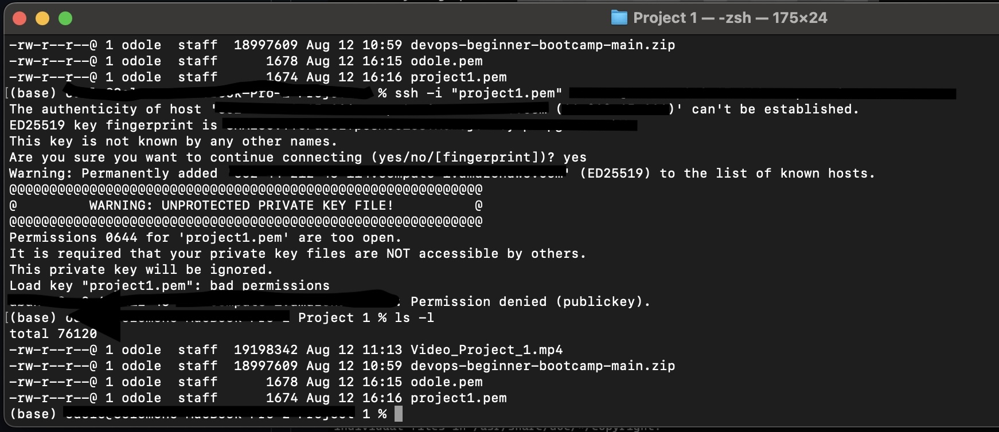

# Documentation of Project1 

Welcome to your my first project in DevOps Beginner Course. In this project, will be:

- **Building with Nginx:** 
- **Connecting with Route53:** 
- **Securing with Certbot:**

By the end of this project, I would have fully deployed and secured a static website ready to share with the world!

## Introduction

Project1 is an introductory assignment designed to immerse students in the principles and practices of DevOps. This project aims to provide hands-on experience with the tools and methodologies central to DevOps, fostering an understanding of how they can streamline and improve software development and deployment processes. 

## Project Requirements

### Create an AWS account

- Root User: xxxxxxx@xxxxx.com
- Account ID: xxxxxxxxxxxxxxxx
- Account Name: Xxxxxxxxxxxxxx
- Service Provider: Amazon Web Services EMEA SARL

### Create an IAM User 

- IAM User: xxxxxxxxxxxxxxxxxxxxxxxxxxxxxxxx
- Permission Policy: AmazonRoute53FullAccess

### Signup for Github & Downloaded vsCode

- A new signup was done (https://github.com/smodole)
- Download vscode for Mac on https://vscode.dev/github/........

### Get a domain name 

- Domain Name: odoleConsult.com.ng
- Domain Registrar: smartweb.com.ng

## Project Implementation

- Create An Ubuntu Server
- Create And Assign an Elastic IP
- Install Nginx and Setup Your Website
- Create An A Record
- Install certbot and Request For an SSL/TLS Certificate
- Open your website on the browser

## Lessons Learned and Conclusion
### Lessons Learned

- The first lesson learned is in the type of permission required for the project.pem file. Permissions 0644 are too open. It there requires that the file could only be read by the owner. I therefore changed the permissions to 0600 using **chmod command**. See the figure below.

- After updating the name servers entries with my domain service provider, it took almost eight (8) hours to propagate the site so that the domain name can now be used on the browser instead of the public IP. The message below shows the information received from my service provider.

- Last of all, the certbot authentication failed because the name servers delayed to be propergated. The installation became successful after name servers were successfully propagated.

### Conclusion

The completion of Project1 has provided a comprehensive introduction to the DevOps culture, emphasizing the importance of collaboration with fellow colleagues. Through this project, I have learnt to effectively configure a web server using EC2, deploy a website and apply SSL. These skills form the foundation of a successful DevOps practice and will be invaluable in future projects and professional endeavors.