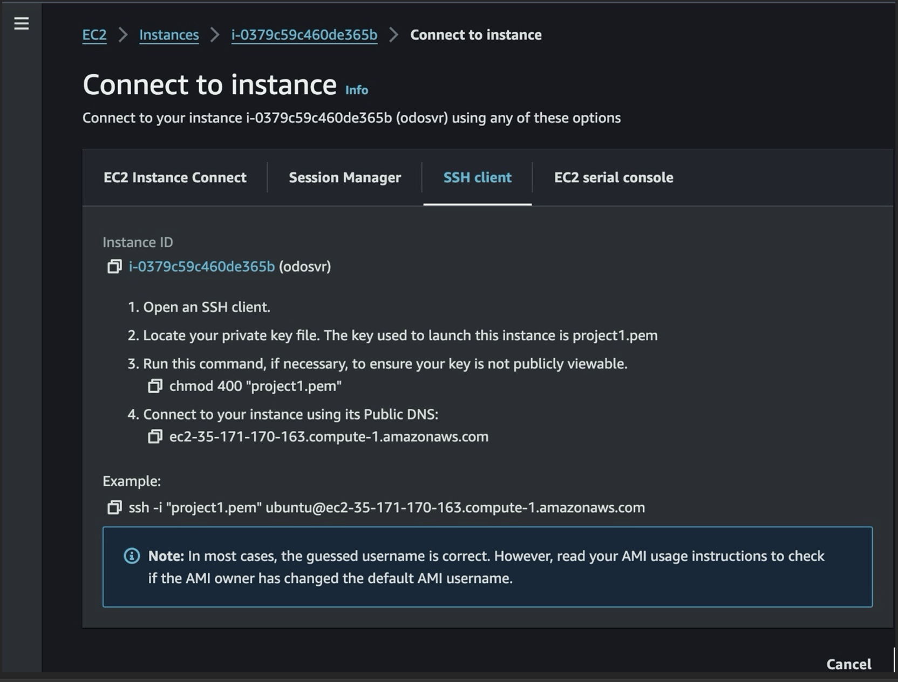

# Setting Up Multiple Websites on Single Server

## Objective(s) of the Project Setup Multiple Static Websites on a Single Server Using Nginx Virtual Hosts

The objective of this project is to understand the concept of subdomains and hosting multiple static websites on a single server using Nginx Virtual Hosts. The next section shows the list of tasks involved in completing the assignment.

## List of Tasks to be accomplished

- Task 1: Spin up a Ubuntu server & assign an elastic IP to it.
- Task 2: SSH into the server and install and configure Nignx on a server.
- Task 3: Create two website directories with two different website templates.
- Task 4: Create two subdomains
- Task 5: Add the IP of the server as A record to the two subdomains.
- Task 6: Configure the Virtual host to point two subdomains to two different website directories.
- Task 7: Validate the setup by accessing the subdomains.  
- Task 8: Create a certbot SSL certificate for the root Domain.
- Task 9: Configure certbot on Nginx for the two websites.
- Task 10: Validate the subdomain websites’ SSL using OpenSSL utility.

## Documentation

Please reference [**Project1**](https://github.com/smodole/devops-beginner/main/project1/project1.md) for guidance on spinning up an Ubuntu server, as well as creating and associating an elastic IP address with your server, among other tasks.

- Copy the path to your instance from the EC2 

- Login to Nginx server through the vsCode using the path copied above

- Check the status of the Ngix server to ensure it is up and running

- Download website template from tooplate.com site by first navigating to the /var/www/html.

- Before setting up a new website, you need to switch as root user. Root user on Ubuntu in general is locked so no user can login as root thus su is not likely to work. For sudo -s to work I will have to be part of the admin group on an Ubuntu machine, which apparently I am not. To create a password for root user, use the following command: **'sudo passwd root'** 

- To set up your website’s configuration, start by creating a new file in the Nginx sites-available directory. Use the following command to open a blank file in a text editor: **'nano /etc/nginx/sites-available/cleaning'**

- Create another new file in the same directory with the following command: **'sudo nano /etc/nginx/sites-available/health'**

- Create a symbolic link for both websites by running the following command and then restart the server. 
sudo ln -s /etc/nginx/sites-available/cleaning /etc/nginx/sites-enabled/
sudo ln -s /etc/nginx/sites-available/health /etc/nginx/sites-enabled/

- Delete the default files in the sites-available and sites-enabled directories by executing the following commands:
sudo rm /etc/nginx/sites-available/default
sudo rm /etc/nginx/sites-enabled/default

- Restart the Nginx server by executing the following command: **'sudo systemctl restart nginx'**

- Click Create record on Route 53, to create the record for your subdomain:

- Repeat the same process while creating your second subdomain record, and confirm that they both exist in the records list

- Open your terminal and run sudo nano /etc/nginx/sites-available/cleaning to edit your settings. Enter the name of your domain and then save your settings.

- Run sudo nano /etc/nginx/sites-available/health to edit your settings. Enter the name of your domain and then save your settings.

- Restart your nginx server by running the sudo systemctl restart nginx command.

- Open the two subdomains in the browser:

http://cleaning.odoleconsult.com.ng/

http://health.odoleconsult.com.ng/

- Install certbot by executing the following commands: 

sudo apt update 
sudo apt install python3-certbot-nginx 
sudo certbot --ngin

- After running the last command to install SSL, the following error message was displayed.

- Based on the reason for the error shown above, we observed that we haven’t created records for www.health.odoleconsult.com.ng and www.cleaning.odoleconsult.com.ng. We therefore created two more entries in our hosted zone.

- SSL is fully and successfully deployed

- Lastly, you can now test the website using the four url below:

cleaning.odoleconsult.com.ng

www.cleaning. odoleconsult.com.ng

health.odoleconsult.com.ng

www.health.odoleconsult.com.ng

#### The End Of Project 2

If you encounter any errors or need assistance at any stage of the project, feel free to contact me 
