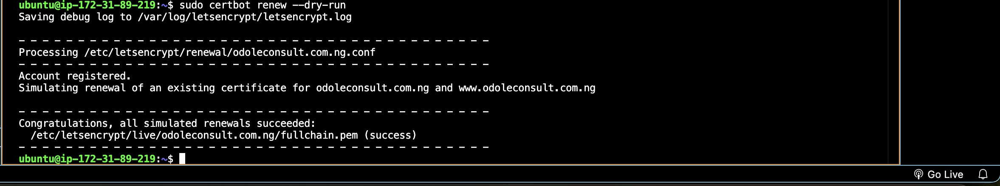

# Project 3: Setup Load Balancing for Static Website Using Nignx

This project aims to teach Layer 7 load balancing and load balancing algorithms using Nginx as a Load Balancer. The load balancer acts as an intermediary for requests from clients seeking resources from the servers behind it.

## Project Tasks

|S/N | Project Tasks                                                                                              |
|----|------------------------------------------------------------------------------------------------------------|
| 1  |Deploy three servers                                                                                        |
| 2  |Set up static websites on two servers using Nginx.                                                          |
| 3  |Use two separate HTML files with distinct content. Deploy one file to each server's index.html location.    |
| 4  |Set up Nginx on the third server. It will act as a load balancer.                                           |
| 5  |Configure Nginx to load and balance traffic between two static websites.                                    |
| 6  |Add the Nginx Load balancer IP to the DNS A record.                                                         |
| 7  |Try accessing the website. Every time you reload the website you should see a different index.html.         |


## Documentation

Before commencing this project ensure that you reference activities under project 1 to get acquainted with setting up your Ubuntu server,  creating and associating an elastic IP address with your server. See project 1 here: https://github.com/smodole/devops-beginner/tree/main/project1/project1.md

- Spin up your 3 ubuntu servers. Ensure you clearly name them so you don't make mistakes.


### Install Nginx and Setup Your Website

- Install Nginx, execute the following commands on your terminal.

`sudo apt update`

`sudo apt upgrade`

`sudo apt install nginx`

- Start your Nginx server by running the `sudo systemctl start nginx` command, enable it to start on boot by executing `sudo systemctl enable nginx`, and then confirm if it's running with the `sudo systemctl status nginx` command.


- Execute `sudo apt install unzip` to install the unzip tool and run the following command to download and unzip your website files `sudo curl -o /var/www/html/2135_mini_finance.zip https://www.tooplate.com/zip-templates/2135_mini_finance.zip && sudo unzip -d /var/www/html/ /var/www/html/2135_mini_finance.zip && sudo rm -f /var/www/html/2135_mini_finance.zip`.


- To set up your website's configuration, start by creating a new file in the Nginx sites-available directory. Use the following command to open a blank file in a text editor: `sudo nano /etc/nginx/sites-available/finance`.

- Copy and paste the following code into the open text editor.

```
server {
    listen 80;
    server_name example.com www.example.com;

    root /var/www/html/example.com;
    index index.html;

    location / {
        try_files $uri $uri/ =404;
    }
}
```

- Edit the `root` directive within your server block to point to the directory where your downloaded website content is stored.

- Create a symbolic link for both websites by running the following command.
`sudo ln -s /etc/nginx/sites-available/finance /etc/nginx/sites-enabled/`
Then run the `sudo nginx -t` command to check the syntax of the Nginx configuration file, and when successful run the `sudo systemctl restart nginx` command.


- Repeat the above steps for the second website.

- Execute `sudo apt install unzip` to install the unzip tool and run the following command to download and unzip your website files `sudo curl -o /var/www/html/2133_moso_interior.zip https://www.tooplate.com/zip-templates/2133_moso_interior.zip && sudo unzip -d /var/www/html/ /var/www/html/2133_moso_interior.zip && sudo rm -f /var/www/html/2133_moso_interior.zip`.


- To set up your website's configuration, start by creating a new file in the Nginx sites-available directory. Use the following command to open a blank file in a text editor: `sudo nano /etc/nginx/sites-available/interior`.

- Copy and paste the following code into the open text editor.

```
server {
    listen 80;
    server_name placeholder.com www.placeholder.com;

    root /var/www/html/placeholder.com;
    index index.html;

    location / {
        try_files $uri $uri/ =404;
    }
}
```

- Edit the `root` directive within your server block to point to the directory where your downloaded website content is stored.

- Create a symbolic link for both websites by running the following command.
`sudo ln -s /etc/nginx/sites-available/interior /etc/nginx/sites-enabled/`


- Run the `sudo nginx -t` command to check the syntax of the Nginx configuration file, and when successful run the `sudo systemctl restart nginx` command.


> [!NOTE]
On your first server, run `sudo rm /etc/nginx/sites-enabled/default`, and on your second server, run `sudo rm /etc/nginx/sites-enabled/default`. This will delete the default site-enabled folders and enable Nginx to serve content from your specified website directories. If you don't delete these default folders, you'll continue to see the default Nginx page.

- Run the `sudo systemctl restart nginx` command to restart your server.

- Check both IP addresses to confirm your website is up and running.


---

### Configure your Load balancer

- Install Nginx on the server you want to use as a load balancer, and execute `sudo systemctl status nginx` to ensure it's running. Execute `sudo nano /etc/nginx/nginx.conf` to edit your Nginx configuration file.


- Add the following within the http block.

```

    upstream cloudghoul {
    server 1; 172.31.82.65
    server 2; 172.31.91.249
    # Add more servers as needed
}

server {
    listen 80;
    server_name odoleconsult.com.ng www.odoleconsult.com.ng;

    location / {
        proxy_pass http://odoleconsult.com.ng;
    }
}

```

- Run `sudo nginx -t` to check for syntax error.

- Apply the changes by restarting Nginx:
`sudo systemctl restart nginx`

---

### Create An A Record

To make your website accessible via your domain name rather than the IP address, you'll need to set up a DNS record. Please, refer to Project 1 for more guadiance.


- Go to the terminal you used in setting your first website and run `sudo nano /etc/nginx/sites-available/finance` to edit your settings. Enter the name of your domain and then save your settings.

- Restart your nginx server by running the `sudo systemctl restart nginx` command.

- Go to the terminal you used in setting your second website and run `sudo nano /etc/nginx/sites-available/interior` to edit your settings. Enter the name of your domain and then save your settings.

- Restart your nginx server by running the `sudo systemctl restart nginx` command.

- Go to your domain name in a web browser to verify that your website is accessible.


- Reload the webpage to ensure the load balancer distributes traffic evenly between your servers.


### Install certbot and Request For an SSL/TLS Certificate

- Install certbot by executing the following commands:
`sudo apt update`
`sudo apt install python3-certbot-nginx`

- Execute the `sudo certbot --nginx` command to request your certificate. Follow the instructions provided by certbot and select the domain name for which you would like to activate HTTPS.


- You should get a congratulatory message that says https has been successfully enabled.



- Access your website to verify that Certbot has successfully enabled HTTPS.


- It is recommended to renew your LetsEncrypt certificate at least every 60 days or more frequently. You can test renewal command in dry-run mode:
`sudo certbot renew --dry-run`


---
---

#### The End Of Project 3
