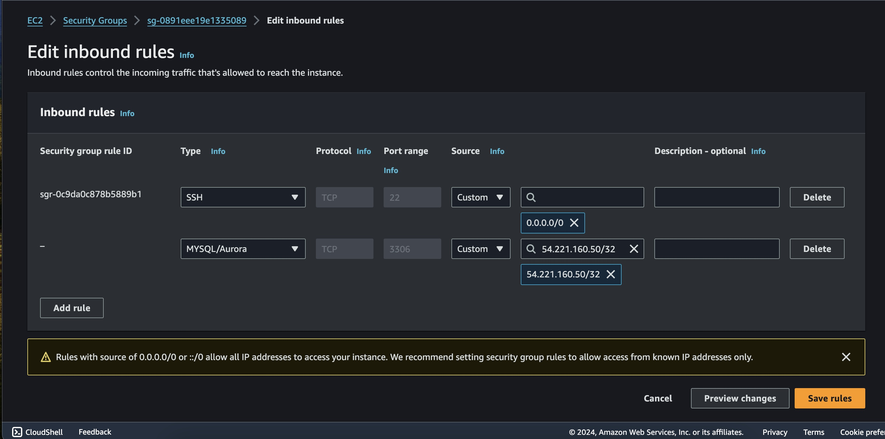
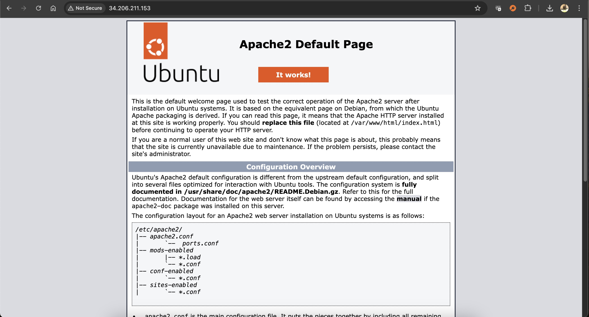
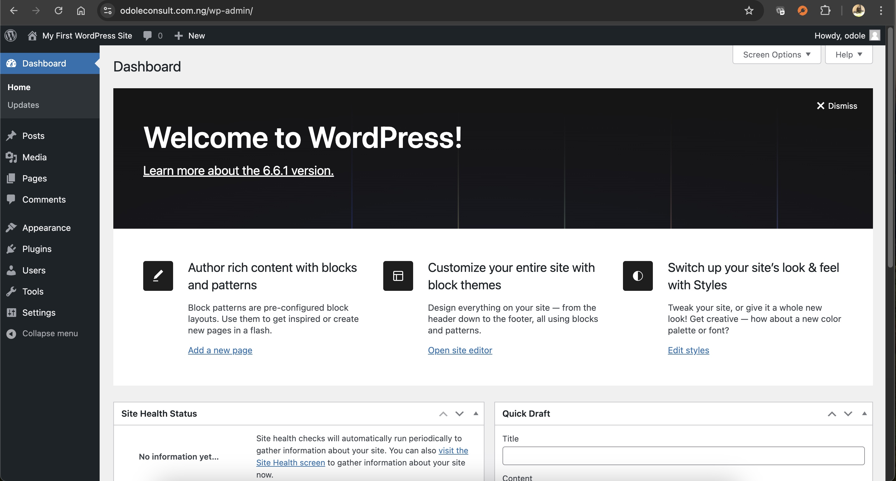

***DOCUMENTATION***

**1. Title Page**

-   **Title:** Setup WordPress Website Using LAMP Stack

-   **Name:** *Solomon Musa Odole*

-   **Date:** *Week 4*

**2. Table of Contents**

-   Introduction

-   Hands-on Project Workflow

-   Troubleshooting

-   Conclusion
  
-   Appendices

**3. Introduction**

-   **Purpose of the Document:** The focus of this project is to setup a
    WordPress website using LAMP stack. A **WordPress website** is a
    type of website built using the WordPress content management system
    (CMS). WordPress is an open-source platform that allows users to
    create, manage, and modify content on a website without needing to
    know how to code. It's widely used for blogs, business sites,
    e-commerce stores, portfolios, and more, thanks to its flexibility,
    user-friendly interface, and a large ecosystem of plugins and themes
    that extend its functionality. The **LAMP stack** is a popular
    open-source software stack used to create and deploy web
    applications. The acronym stands for Linux, Apache, MySQL (or
    MariaDB), and PHP (or Perl/Python).

    -   Linux: The operating system.

    -   Apache: The web server that handles HTTP requests.

    -   MySQL: The relational database management system (RDBMS) that
        stores website data.

    -   PHP: The programming language used to process dynamic content on
        the web server.

**4. Hands-on Project Workflow**

-   On your EC2 Dashboard, create an instance called ***project4*** and
    follow the steps taken in PROJECT 1 to allocate and associate an
    elastic IP to the instance
    

-   Create a Key Pair that you will use to logon into your Linux server
-   

-   In the ***Security*** properties of the instance, select ***Security
    Group***

-   Click on ***Edit inbound rules***

-   Click on ***Add rules***

-   *Click on** Custom TCP** and select** MySQL/Aurora ***

-   Enter the ***IP address*** (54.221.160.50/32) to allow access to
    MySQL by the web server only and click ***Save rules***. Note that
    using 0.0.0.0 open up access to the public.

-   Connect to your Ubuntu server using ssh

> ***ssh -i \"project4.pem\"
> ubuntu@ec2-54-221-160-50.compute-1.amazonaws.com***

-   Install Apache by first running **sudo apt update** and then **sudo
    apt install apache2**

-   *To enable Apache to start on boot, execute **sudo systemctl enable
    apache2**, and then verify its status with the **sudo systemctl
    status apache2** command*

-   *Confirm your server is running by running the command (video):
    **curl http://localhost:80***

-   *Confirm your Apache is also running on the internet through your
    browser by using the following url:
    [**http://localhost:80**](http://localhost:80)* or the copied Public
    Ipv4 (34.206.211.153). The installation was successful as shown in
    the picture below:

-   *To install mysql, run the following command: **sudo apt install
    mysql-server***

-   Log into the mysql installed through the console using the following
    commancd: **sudo mysql**

-   Set the password by running the following command where 'pass' is
    your new password. Type 'exit' to return to the prompt: **ALTER USER
    \'root\'@\'localhost\' IDENTIFIED WITH mysql_native_password BY
    \'pass\';**

-   Run the following command to start the interactive script: **sudo
    mysql_secure_installation**

-   Set your password validation policy to low, medium or high.

-   Run the following command to start MySQL on boot: **sudo systemctl
    enable mysql**

-   Run the following command to install PHP: **sudo apt install
    php-curl php-gd php-mbstring php-xml php-xmlrpc php-soap php-intl
    php-zip**

-   Run the following command to confirm that PHP is installed correctly
    and working: **php -v**

-   Create a directory for our project called ***projectlamp*** using
    the following command: **sudo mkdir /var/www/projectlamp**

-   Assign the ownership of the project to our current system user using
    the following command: **sudo chown -R \$USER:\$USER
    /var/www/projectlamp**

-   Create a new configuration file using the following command and
    paste the following: **sudo vi
    /etc/apache2/sites-available/projectlamp.conf**

-   Run the following command to show the newly configured file: **sudo
    ls /etc/apache2/sites-available**

-   **Run the following command to enable the new virtual host: sudo
    a2ensite projectlamp**

-   Use the following command to disable Apache's default page: **sudo
    a2dissite 000-default**

-   Run the following command to ensure our configuration is syntax
    free: **sudo apache2ctl configtest**

-   Run the following command to restart Apache: **sudo systemctl reload
    apache2**

-   To test that our installations and configurations are okay, we will
    create a web page called ***index.html*** using following command:
    **sudo echo \'Hello LAMP from Dr. Solomon, Musa Odole \>
    /var/www/projectlamp/index.html**

-   Open our browser using the same public IP address to check if the
    configuration was okay. The picture below shows that our
    configurations are all alright.

-   Remove the test index.html file using the following command: **sudo
    rm /var/www/projectlamp/index.html**

-   By default an index.html file takes precedence over any other file
    in the directory. In order to alter this to accept an index.php file
    first, use vi or nano to reconfigure the **dir.conf** file by moving
    the index.php first on the line using: **sudo nano
    /etc/apache2/mods-enabled/dir.conf**

-   Save the configured file by using Ctrl+Q and save.

-   Restart Apache again using the following command: **sudo systemctl
    reload apache2**

-   To test our configuration, create an index.php file using nano:
    **nano /var/www/projectlamp/index.php**

-   Go back to your browser and check that the configuration has taken
    effect as shown below:

-   The PHP page contains information that could compromise your site,
    so it is advised to remove the file using the following command:
    **sudo rm /var/www/projectlamp/index.php**

-   [Install WordPress]{.underline} by downloading its file into **cd
    /var/www/html** using the following command: **sudo wget -c
    http://wordpress.org/latest.tar.gz**

-   Extract the file by using the following command: **sudo tar -xzvf
    latest.tar.gz**

-   To check the user running the web server, use the following command:
    **ps aux \| grep apache \| grep -v grep**

-   The user is found to be **www-data**

-   Grant access to the wordpress files to the **www-data** user using
    the following command: **sudo chown -R www-data:www-data
    /var/www/html/wordpress**

-   Access your [MySQL account to create a database for
    WordPress]{.underline} using the following command: **sudo mysql -u
    root -p**

-   Create a database named wp_db using the command: **CREATE DATABASE
    wp_db;**

-   You can create a new user to access the database with the following
    command: **CREATE USER odole@localhost IDENTIFIED BY
    \'wp-password\';**

-   To grant all privileges to the created user needed to work with the
    database, use the following: **GRANT ALL PRIVILEGES ON wp_db.\* TO
    odole@localhost; FLUSH PRIVILEGES;**

-   Grant executable permissions recursively (-R) to the wordpress
    folder using the following command: **sudo chmod -R 777 wordpress/**

-   Change to wordpress directory using cd /var/www/html/wordpress

-   To start reconfiguring wordpress, first rename the configuration
    file using the following command: **mv wp-config-sample.php
    wp-config.php**

-   Then edit the file using the following command: **sudo nano
    wp-config.php**

-   Modify the configuration file projectlamp.conf using the following
    command: **sudo nano /etc/apache2/sites-available/projectlamp.conf**

-   Restart Apache using the following command: **sudo systemctl reload
    apache2**

-   Open your wordpress from the browser and click **Continue**

-   Enter the required information and click **Install WordPress**

-   WordPress Successfully installed!

-   Login to WordPress Dashboard

-   To make the website accessible using my domain name,
    odoleconsult.com.ng, Use Route 53 to create an A record for my
    domain as taught in Project 1

-   Click on **Create Record**

-   Paste you IP Address and click on Create Record

-   Two A records created successfully

-   Configure your apache configuration file to point to your domain
    name using the following command: **sudo nano
    /etc/apache2/sites-available/projectlamp.conf**

-   Update wp-config file using the following command and add the lines
    shown in the diagram: **sudo nano wp-config.php**

-   Restart Apache server using the following command: **sudo systemctl
    reload apache2**

-   Open the site in your browser using your domain name,
    **odoleconsult.com.ng**

-   Login to your wordpress admin portal using the following url:
    [**http://odoleconsult.com.ng/wp-admin**](http://odoleconsult.com.ng/wp-admin)

-   Install SSL/TLS to secure your site using the following commands:

    -   **sudo apt update **

    -   **sudo apt install certbot python3-certbot-apache**

    -   **sudo certbot \--apache**

-   Installation Successful

-   Open the wordpress wesite and the admin site on browser and observe
    now that it is secure

**8. Troubleshooting**

-   Common Issues Encountered (a): While loading the linux server using
    the ssh command, we ran into the following error:

-   Solutions (a): The error was resolved by changing the permission of
    the project4.pem to 600 using the command:

> Chmod 600 project4.pem

-   Common Issues Encountered (b): The page couldn't be displayed after
    the installation of Apache

-   Solution (b): This happened because I forgot to select the two
    checkboxes when creating my instance

**9. Conclusion**

-    Project Successfully Delivered!
**10. Appendices**

-   References: Project 1

