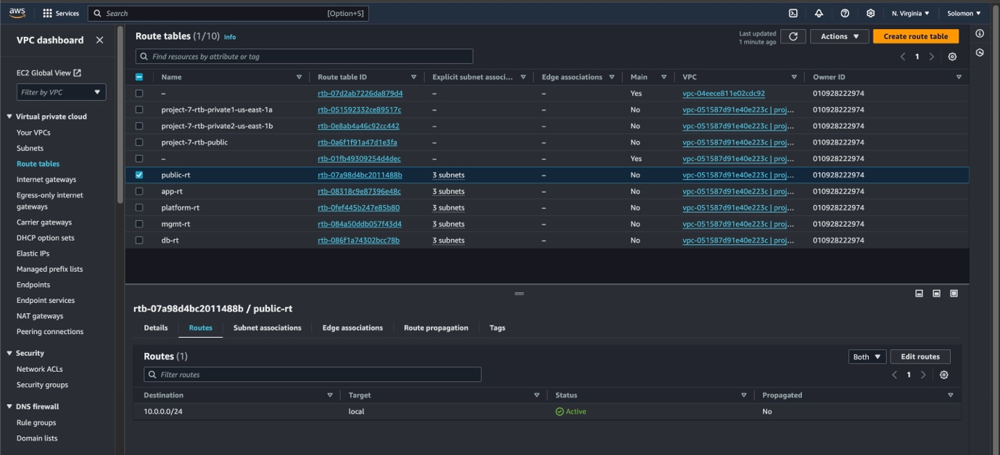

**<u>Virtual Private Cloud (VPC) Documentation</u>**

**VPC Requirements**

1.  CIDR Block: 10.0.0.0/16

2.  Region: us-west-2

3.  Availability Zones: us-west-2a, us-west-2b, us-west-2c

4.  Subnets: 15 Subnets (One per availability Zone)

**STEP 1:**

We shall first create a VPC for our project and assign an internet
gateway to it

- Login to your AWS management console and search VPC

- Now we create an Internet Gateway

We will follow the following subnet naming schemes:

> *EnvName-AppType-RouteType-AZ*

For example,

*Prod-Web-Public-2a*

Let's create some subnet

- Public Subnets

| Subnet Name        | Availability Zone | CIDR Block   | Type   |
|--------------------|-------------------|--------------|--------|
| Prod-Web-Public-2a | us-west-2a        | 10.0.0.0/28  | Public |
| Prod-Web-Public-2b | us-west-2b        | 10.0.0.16/28 | Public |
| Prod-Web-Public-2c | us-west-2c        | 10.0.0.32/28 | Public |

**Using the above table data, we will create the public subnet**

During the process of creating the subnets, the following error was
encountered. To overcome this, the three subnets were created
separately.

**Using the above steps, create the other subnets with the data below**

- Application Subnets

| Subnet Name         | Availability Zone | CIDR Block   | Type    |
|---------------------|-------------------|--------------|---------|
| Prod-App-Private-2a | us-west-2a        | 10.0.0.48/28 | Private |
| Prod-App-Private-2b | us-west-2b        | 10.0.0.64/28 | Private |
| Prod-App-Private-2c | us-west-2c        | 10.0.0.80/28 | Private |

- Database Subnets

| Subnet Name        | Availability Zone | CIDR Block    | Type    |
|--------------------|-------------------|---------------|---------|
| Prod-DB-Private-2a | us-west-2a        | 10.0.0.96/28  | Private |
| Prod-DB-Private-2b | us-west-2b        | 10.0.0.112/28 | Private |
| Prod-DB-Private-2c | us-west-2c        | 10.0.0.128/28 | Private |

- Management Subnets

| Subnet Name          | Availability Zone | CIDR Block    | Type    |
|----------------------|-------------------|---------------|---------|
| Prod-Mgmt-Private-2a | us-west-2a        | 10.0.0.144/28 | Private |
| Prod-Mgmt-Private-2b | us-west-2b        | 10.0.0.160/28 | Private |
| Prod-Mgmt-Private-2c | us-west-2c        | 10.0.0.176/28 | Private |

- Platform Subnets

| Subnet Name              | Availability Zone | CIDR Block    | Type    |
|--------------------------|-------------------|---------------|---------|
| Prod-Platform-Private-2a | us-west-2a        | 10.0.0.192/28 | Private |
| Prod-Platform-Private-2b | us-west-2b        | 10.0.0.208/28 | Private |
| Prod-Platform-Private-2c | us-west-2c        | 10.0.0.224/28 | Private |

**This is how it should look like after you create all the subnets**

**Route Table Design**

For each subnet group, we will create a custom route table and assign
rules required for the specific subnets.

For example, all three public subnets will share the same public-subnet
route table.

| Subnet     | Destination CIDR | Target           |
|------------|------------------|------------------|
| Public     | 0.0.0.0/0        | Internet Gateway |
| App        | 0.0.0.0/0        | Nat Gateway      |
| DB         | 0.0.0.0/0        | Nat Gateway      |
| Management | 0.0.0.0/0        | Nat Gateway      |
| Platform   | 0.0.0.0/0        | Nat Gateway      |

Using the table above you will create 5 route tables

- Let's create public route table

- We add 3 public subnets (prod-web-public a,b,c)

**Using the table and steps above create the other route tables and
their subnet association**

**NAT Gateway**

A NAT gateway is a Network Address Translation (NAT) service. You can
use a NAT gateway so that instances in a private subnet can connect to
services outside your VPC but external services cannot initiate a
connection with those instances.

We need to create a NAT gateway and attach it to all our route tables
created earlier

- select a subnet and allocate an elastic ip

**Now we will add the NAT gateway to our route tables one by one:**

First of all, add route to each route table, we are adding to platorm
route table now. For Destination select 0.0.0.0/0, and for the Target
select NAT gateway. Select the NAT gateway created earlier and save
changes

- Notice the status of the NAT gateway it's active

**Do the above steps for the other route tables ie for the DB, APP,
MANAGEMENT ROUTE TABLES**

If you noticed we did not do anything to our public subnet we want to
route traffic uing a service called internet gateway so let's attach it
to the public route table

**AWS VPC Topology**

The following diagram shows the high-level VPC topology for our design.

Note: Both the internet Gateway (IGW) and NAT gateway(NAT-GW) gets
deployed in the public subnet.

To check our VPC topology:

**Network ACLs**

Network access control list (NACL) is the native VPC functionality to
control the inbound and outbound traffic at the subnet level.

In our architecture, the connection to the DB subnet should be allowed
only from the App subnet and management subnet. The public subnet should
not have direct access to the DB subnet.

The following are the tables for inbound and outbound rules for the DB
NACL.

**DB NACL (Inbound Rules)**

| Rule Number | Type        | Protocol | Port Range | Source IP     | Allow/Deny |
|-------------|-------------|----------|------------|---------------|------------|
| 100         | Custom TCP  | TCP      | 3306       | 10.0.0.96/28  | Allow      |
| 110         | Custom TCP  | TCP      | 3306       | 10.0.0.112/28 | Allow      |
| 120         | Custom TCP  | TCP      | 3306       | 10.0.0.128/28 | Allow      |
| \*          | All Traffic | All      | All        | 0.0.0.0/0     | Deny       |

**DB NACL (Outbound Rules)**

| Rule Number | Type        | Protocol | Port Range | Destination IP | Allow/Deny |
|-------------|-------------|----------|------------|----------------|------------|
| 100         | Custom TCP  | TCP      | 3306       | 10.0.0.192/28  | Allow      |
| 110         | Custom TCP  | TCP      | 3306       | 10.0.0.208/28  | Allow      |
| 120         | Custom TCP  | TCP      | 3306       | 10.0.0.224/28  | Allow      |
| \*          | All Traffic | All      | All        | 0.0.0.0/0      | Deny       |

The above table serves as a guide to how your implemetation would look
like: Here is a step by step on a Network ACLS:

