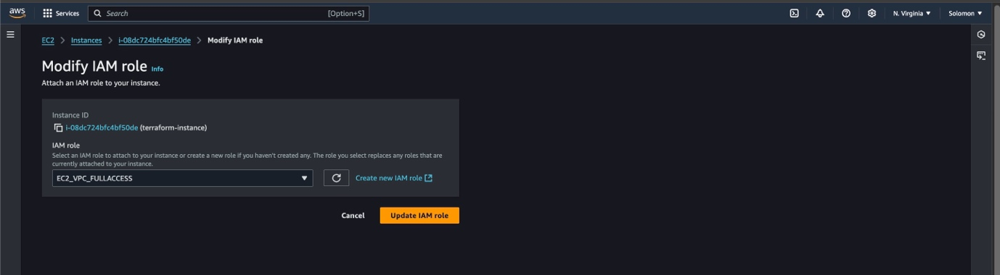
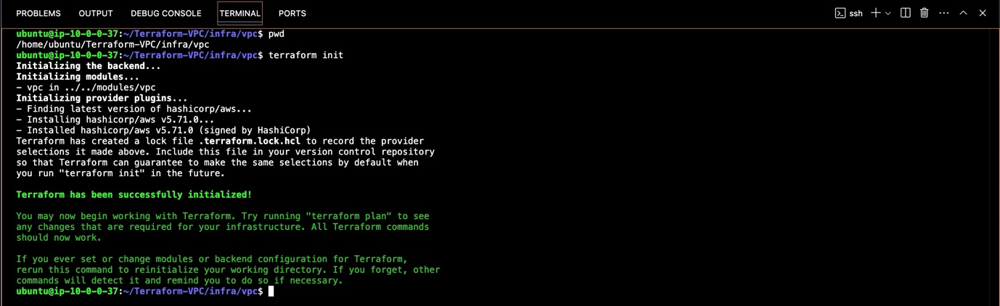

**AWS VPC using Terraform**

**Two Popular Tools for Infrastructure as a Code (IaC) are:**

- Terraform

- CloudFormation

**Definition of IoC**

**Infrastructure as Code (IaC**) is a key DevOps practice that involves
managing and provisioning computing infrastructure through
machine-readable configuration files, rather than through physical
hardware configuration or interactive configuration tools. 

**Benefits of IaC:**

- Automation: Reduces manual errors, increases efficiency, and speeds up
  the deployment process.

- **Consistency:** Ensures that the same environment is provisioned
  every time, reducing discrepancies between different environments
  (e.g., development, testing, production)

- **Version Control:** Infrastructure configurations can be versioned
  and stored in repositories (e.g., Git), allowing teams to track
  changes, revert to previous states, and collaborate more effectively.

- **Scalability:** IaC makes it easier to scale infrastructure up or
  down by simply modifying the configuration files

**Why Use Terraform?**

- Multi-Provider Support: Terraform supports a wide range of cloud
  providers (e.g., AWS, Azure, Google Cloud), making it a versatile tool
  for managing infrastructure across different platforms.

- Declarative Language: Terraform uses a declarative language (HashiCorp
  Configuration Language - HCL) to define infrastructure. This means you
  describe the desired state of your infrastructure, and Terraform takes
  care of achieving that state.

- State Management: Terraform keeps track of the state of your
  infrastructure, allowing it to detect changes and apply only the
  necessary updates. This state management is crucial for maintaining
  the consistency of your infrastructure.

- Modularity: Terraform supports the use of modules, which are reusable
  components that encapsulate specific pieces of infrastructure. This
  modularity promotes code reuse and simplifies the management of
  complex infrastructures.

- Community and Ecosystem: Terraform has a vibrant community and a rich
  ecosystem of providers and modules, making it easier to find resources
  and get support.

**Key Terraform Commands**

- **terraform init**: Initializes a new or existing Terraform working
  directory. Prepares your directory for Terraform operations by
  downloading necessary provider plugins. e.g. *terraform init*

- **terraform plan:** Creates an execution plan showing what changes
  Terraform will make to your infrastructure. Review planned changes
  before applying them. e.g. *terraform plan*

- **terraform apply:** Applies the changes required to reach the desired
  state as defined in your configuration files. Executes the actions
  proposed by terraform plan. e.g. *terraform apply*

- **terraform destroy:** Destroys the Terraform-managed infrastructure.
  Removes all resources defined in your configuration files. e.g.
  *terraform destroy*

- **terraform validate:** Validates the configuration files for syntax
  and internal consistency. Checks for errors before running other
  commands.e.g. *terraform validate*

- **terraform fmt:** Formats Terraform configuration files to follow a
  canonical style. Ensures consistent formatting of your configuration
  files. e.g. *terraform fmt*

- **terraform show:** Displays a human-readable output of the state or
  plan. Inspects the current state or details of a plan. e.g. *terraform
  show*

- **terraform output:** Reads and displays the values of output
  variables from the state file. Accesses outputs defined in your
  configuration. E.g. *terraform output*

- **terraform state:** Advanced management of the Terraform state file.
  Includes subcommands to inspect and modify the state. e.g. **terraform
  state list**

For more detailed information about this commands, visit the [Terraform
Documentation](https://www.terraform.io/docs)

Documentation for this Project

1.  Spin up an EC2 and attach the following IAM roles to it:

<!-- -->

1.  AmazonVPCFullAccess

2.  AmazonEC2FullAccess

>  style="width:6.26806in;height:3.42431in" />

2.  Create an EC2 Instance, Ubuntu 22.04

3.  Attach IAM role to your instance

4.  Connect to your instance via ssh

5.  Install Terraform using the following command:

*sudo snap install terraform*

**Terraform AWS VPC Creation Workflow**

Note: The VPC and subnets for this demo is created based on the VPC
design document.

We will be creating the VPC with the following

1.  CIDR Block: 10.0.0.0/16

2.  Region: us-west-2

3.  Availability Zones: us-west-2a, us-west-2b, us-west-2c

4.  Subnets: 15 Subnets (One per availability Zone)

5.  Public Sunets (3)

6.  App Subets (3)

7.  DB Subnets (3)

8.  Management Subnet (3)

9.  Platform Subnet (3)

10. NAT Gateway for Private subnets

11. Internet Gateway for public subnets.

**Stage 1: Clone thge repo into the instance and CD in the Cloned
Repository**

- Clone it using the following command:

*git clone https://github.com/TobiOlajumoke/Terraform-VPC.git*

- Then cd into the terraform-vpc folder

*cd terraform-vpc*

Stage 2:

- cd into vars/dev/vpc.tfvars

- using any text editor of your choce Nano or VIM and change the \#tag
  owner to your name eg "Femi" in this demo i used "DevOps"

> *\#vpc*
>
> *region = "us-west-2"*
>
> *vpc_cidr_block = "10.0.0.0/16"*
>
> *instance_tenancy = "default"*
>
> *enable_dns_support = true*
>
> *enable_dns_hostnames = true*
>
> *\#elastic ip*
>
> *domain = "vpc"*
>
> *\#nat-gateway*
>
> *create_nat_gateway = true*
>
> *\#route-table*
>
> *destination_cidr_block = "0.0.0.0/0"*
>
> *\#tags*
>
> *owner = "DevOps"*
>
> *environment = "dev"*
>
> *cost_center = "DevOps-commerce"*
>
> *application = "OpsApp"*
>
> *\#subnet*
>
> *map_public_ip_on_launch = true*
>
> *public_subnet_cidr_blocks = \["10.0.1.0/24", "10.0.2.0/24",
> "10.0.3.0/24"\]*
>
> *app_subnet_cidr_blocks = \["10.0.4.0/24", "10.0.5.0/24",
> "10.0.6.0/24"\]*
>
> *db_subnet_cidr_blocks = \["10.0.7.0/24", "10.0.8.0/24",
> "10.0.9.0/24"\]*
>
> *management_subnet_cidr_blocks = \["10.0.10.0/24", "10.0.11.0/24",
> "10.0.12.0/24"\]*
>
> *platform_subnet_cidr_blocks = \["10.0.13.0/24", "10.0.14.0/24",
> "10.0.15.0/24"\]*
>
> *availability_zones = \["us-west-2a", "us-west-2b", "us-west-2c"\]*
>
> *\#public nacl*
>
> *ingress_public_nacl_rule_no = \[100\]*
>
> *ingress_public_nacl_action = \["allow"\]*
>
> *ingress_public_nacl_from_port = \[0\]*
>
> *ingress_public_nacl_to_port = \[0\]*
>
> *ingress_public_nacl_protocol = \["-1"\]*
>
> *ingress_public_nacl_cidr_block = \["0.0.0.0/0"\]*
>
> *egress_public_nacl_rule_no = \[200\]*
>
> *egress_public_nacl_action = \["allow"\]*
>
> *egress_public_nacl_from_port = \[0\]*
>
> *egress_public_nacl_to_port = \[0\]*
>
> *egress_public_nacl_protocol = \["-1"\]*
>
> *egress_public_nacl_cidr_block = \["0.0.0.0/0"\]*
>
> *\#app nacl*
>
> *ingress_app_nacl_rule_no = \[100\]*
>
> *ingress_app_nacl_action = \["allow"\]*
>
> *ingress_app_nacl_from_port = \[0\]*
>
> *ingress_app_nacl_to_port = \[0\]*
>
> *ingress_app_nacl_protocol = \["-1"\]*
>
> *ingress_app_nacl_cidr_block = \["0.0.0.0/0"\]*
>
> *egress_app_nacl_rule_no = \[200\]*
>
> *egress_app_nacl_action = \["allow"\]*
>
> *egress_app_nacl_from_port = \[0\]*
>
> *egress_app_nacl_to_port = \[0\]*
>
> *egress_app_nacl_protocol = \["-1"\]*
>
> *egress_app_nacl_cidr_block = \["0.0.0.0/0"\]*
>
> *\##db nacl*
>
> *ingress_db_nacl_rule_no = \[100\]*
>
> *ingress_db_nacl_action = \["allow"\]*
>
> *ingress_db_nacl_from_port = \[0\]*
>
> *ingress_db_nacl_to_port = \[0\]*
>
> *ingress_db_nacl_protocol = \["-1"\]*
>
> *ingress_db_nacl_cidr_block = \["0.0.0.0/0"\]*
>
> *egress_db_nacl_rule_no = \[200\]*
>
> *egress_db_nacl_action = \["allow"\]*
>
> *egress_db_nacl_from_port = \[0\]*
>
> *egress_db_nacl_to_port = \[0\]*
>
> *egress_db_nacl_protocol = \["-1"\]*
>
> *egress_db_nacl_cidr_block = \["0.0.0.0/0"\]*
>
> *\##management nacl*
>
> *ingress_management_nacl_rule_no = \[100\]*
>
> *ingress_management_nacl_action = \["allow"\]*
>
> *ingress_management_nacl_from_port = \[0\]*
>
> *ingress_management_nacl_to_port = \[0\]*
>
> *ingress_management_nacl_protocol = \["-1"\]*
>
> *ingress_management_nacl_cidr_block = \["0.0.0.0/0"\]*
>
> *egress_management_nacl_rule_no = \[200\]*
>
> *egress_management_nacl_action = \["allow"\]*
>
> *egress_management_nacl_from_port = \[0\]*
>
> *egress_management_nacl_to_port = \[0\]*
>
> *egress_management_nacl_protocol = \["-1"\]*
>
> *egress_management_nacl_cidr_block = \["0.0.0.0/0"\]*
>
> *\#platform nacl*
>
> *ingress_platform_nacl_rule_no = \[100\]*
>
> *ingress_platform_nacl_action = \["allow"\]*
>
> *ingress_platform_nacl_from_port = \[0\]*
>
> *ingress_platform_nacl_to_port = \[0\]*
>
> *ingress_platform_nacl_protocol = \["-1"\]*
>
> *ingress_platform_nacl_cidr_block = \["0.0.0.0/0"\]*
>
> *egress_platform_nacl_rule_no = \[200\]*
>
> *egress_platform_nacl_action = \["allow"\]*
>
> *egress_platform_nacl_from_port = \[0\]*
>
> *egress_platform_nacl_to_port = \[0\]*
>
> *egress_platform_nacl_protocol = \["-1"\]*
>
> *egress_platform_nacl_cidr_block = \["0.0.0.0/0"\]*
>
> *\#endpoint*
>
> *create_s3_endpoint = true*
>
> *create_secrets_manager_endpoint = true*
>
> *create_cloudwatch_logs_endpoint = true*

**Stage 3: Initialize Terraform and Execute the Plan**

- Now cd in to infra/vpc folder and execute the terraform plan to
  validate the configurations.

- Firstly, Initialize Terraform

- Execute the plan using the command:

> *terraform plan -var-file=../../vars/dev/vpc.tfvars*

**Stage 4: Create VPC With Terraform Apply**

Lets create the VPC and related resources using terraform apply

*terraform apply -var-file=../../vars/dev/vpc.tfvars*

**Stage 5: Validate**

Head over to the AWS Console the check the Resource Map of the VPC.
Click on the created VPC and scroll down to view the Resource Map. You
should see 15 subnets , 6 route tables, internet gateway and NAT gateway
as shown below.

**Stage 6: Cleanup the Resources**

- Clean up the resources created by Terraform, execute the following
  command

*terraform destroy -var-file=../../vars/dev/vpc.tfvars*

- Terminate your instance
