**<u>DOCUMENTATION FOR DOCKER</u>**

**Dockerfile: Building Your First Image**

1.  **Provisioning An Instance**

- Spin up an Ubuntu 24.04 t2.micro this is where we'll be doing the
  project in

- SSH into the instance

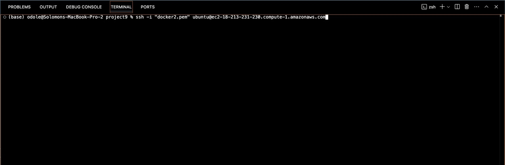

2.  **Install and Start Docker**

- Update your package index using ***sudo apt update***

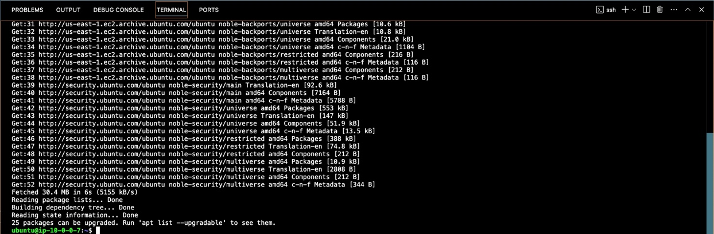

- Install Docker using ***sudo apt install docker.io -y***

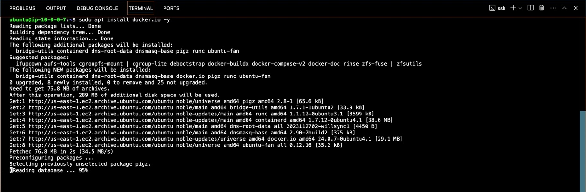

- Start Docker using the following:

> ***sudo systemctl start docker***
>
> ***sudo systemctl enable docker***

- Check the Status of Docker using ***sudo systemctl status docker***

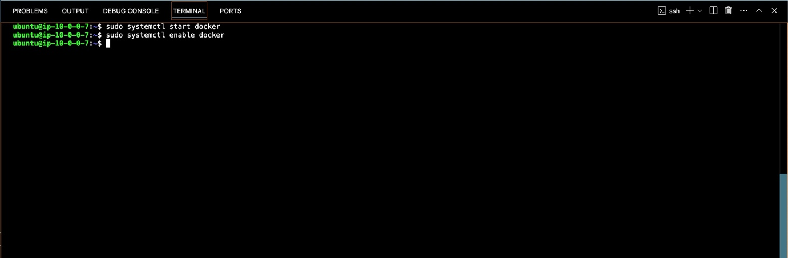

- Ctrl + C to exit the running docker

3.  **Clone the Docker Project**

> Once Docker is installed and set up, clone the project repository.

- Install Git (if not installed) using ***sudo apt install git -y***

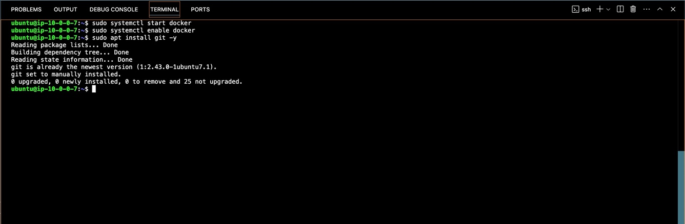

- Clone the project repository using the following:

> ***git clone https://github.com/TobiOlajumoke/docker-flask***
>
> ***cd docker-flask***

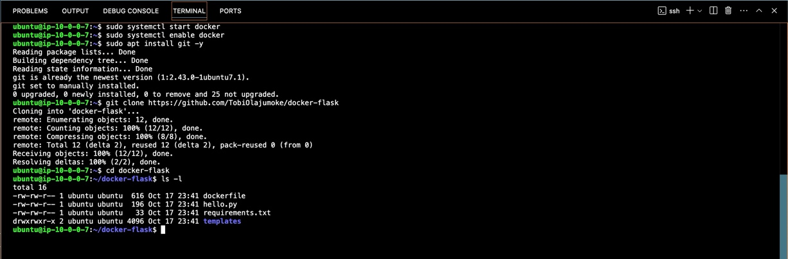

- The docker file using ***cat dockerfile***

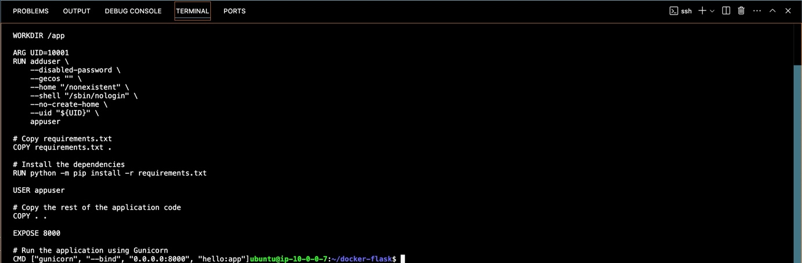

4.  **Run the Docker Application**

- Build the Docker Image by using

> ***sudo*** ***docker build -t flask-application:1.0.0 .***

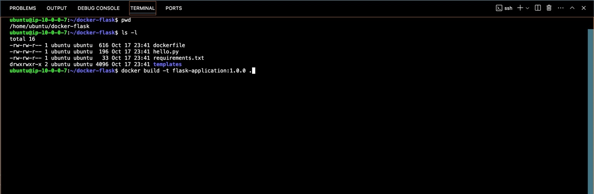

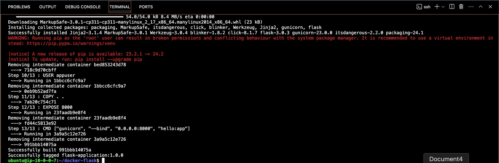

- Check if the image built using ***sudo docker images***

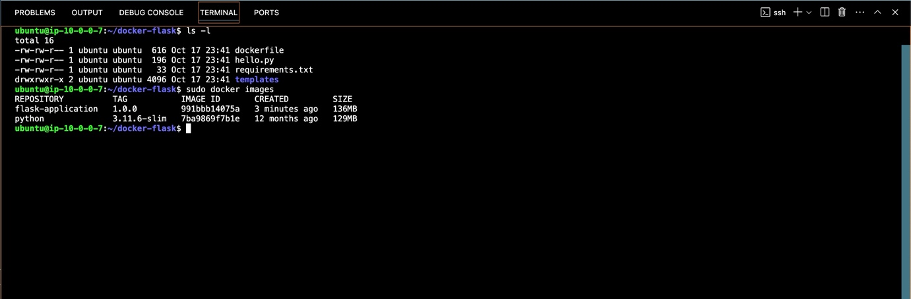

5.  R**un the Docker Container**:

- ***docker run -d -p 8000:8000 flask-application:1.0.0***

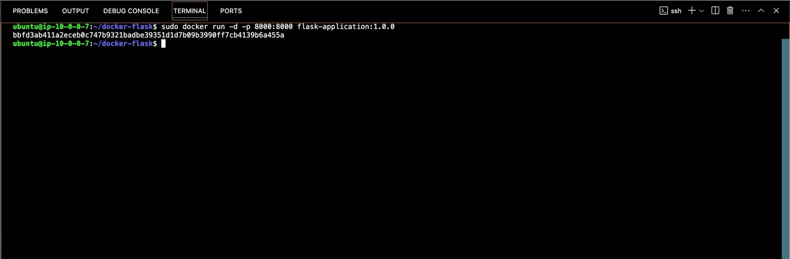

- Check if the container is running if it is PROCEED to 6 using

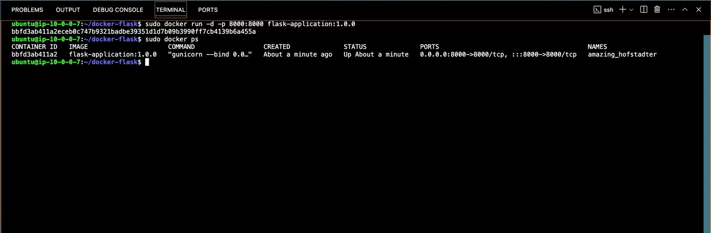

6.  Test in Browser Now, go to your browser and access your EC2 public
    IP to check if the app is running properly:
    ***http://18.213.231.230:8000/***

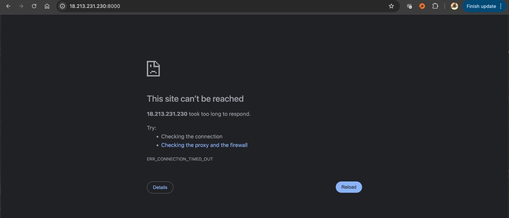

> The page didn’t display successfully. This shows that something is
> wrong. Add the port 8000 to our security group of our instance so do
> that and try accessing the EC2 public IP.

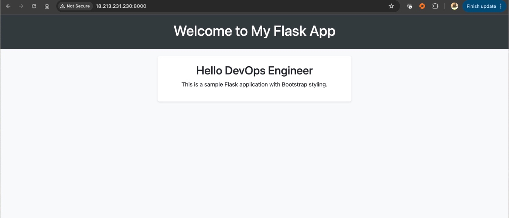

I have successfully deployed the Dockerized Flask app on an AWS EC2
instance. This is a common workflow in modern cloud infrastructure where
applications are containerized for ease of deployment, scalability, and
management.

7.  P**ushing Docker Images to Docker Hub**

After successfully building and running your Docker image, you may want
to share it with others or deploy it to different environments. Docker
Hub is a cloud-based registry service that allows you to store and
distribute Docker images

- Go to [Docker Hub](https://hub.docker.com/)

- Sign up for a free account if you don’t have one already

- Create a repo

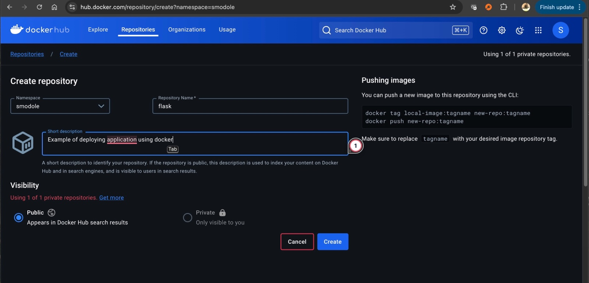

- Use the Docker CLI to log in to your Docker Hub account on your
  terminal:

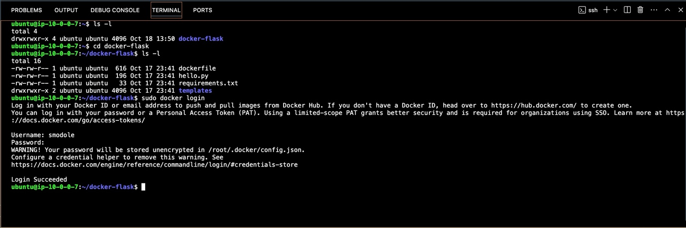

- Tag your image with your Docker Hub username and a repository name.
  The tagging format is:

> ***\<your-dockerhub-username\>/\<repository-name\>:\<tag\>***
>
> ***sudo docker tag flask-application:1.0.0
> smodole/flask-application:1.0.0***

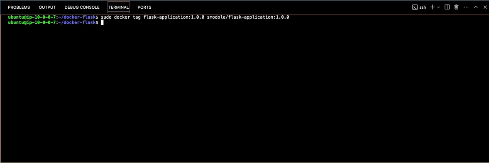

8.  **Push the Image to Docker Hub**

Once your image is tagged, you can push it to Docker Hub using the
following command:

***sudo docker push yourusername/flask-application:1.0.0***

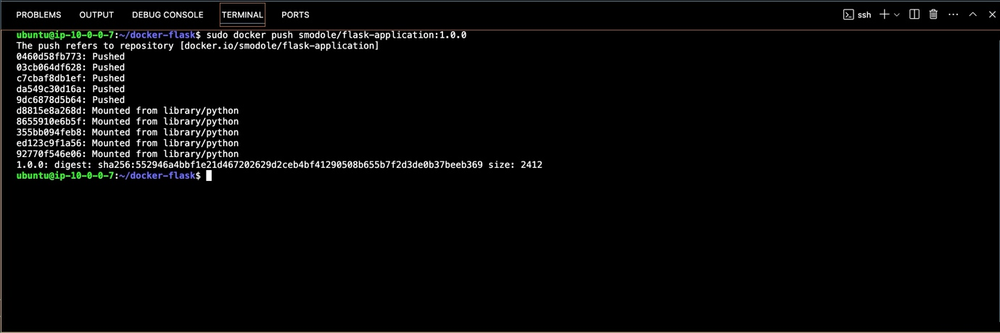

9.  **Verify the Push**

After the push completes, you can verify that your image is on Docker
Hub by visiting your Docker Hub profile and checking the repositories.

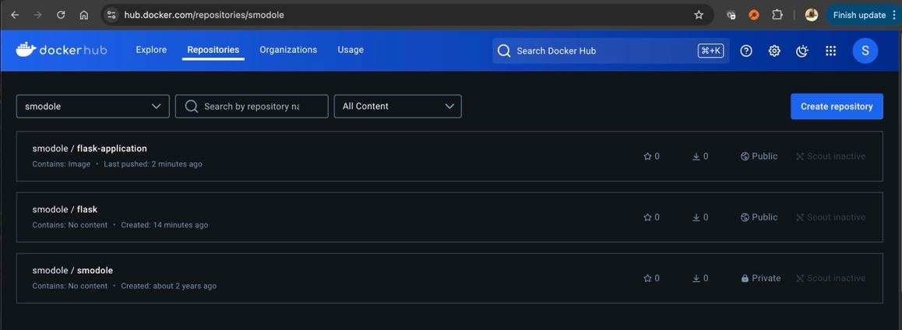

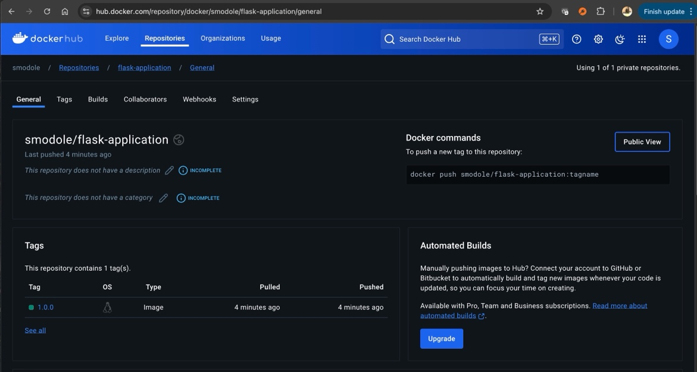
